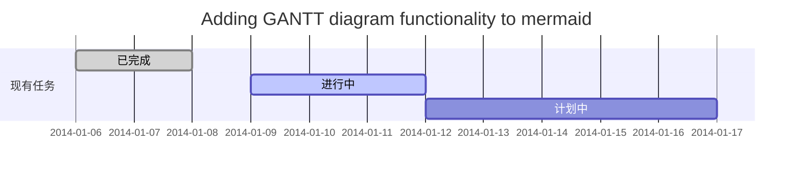
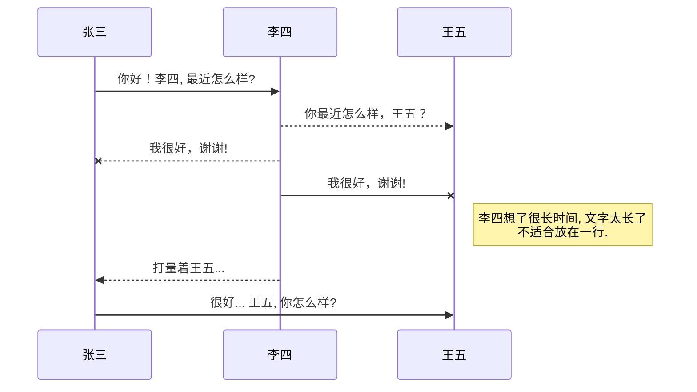
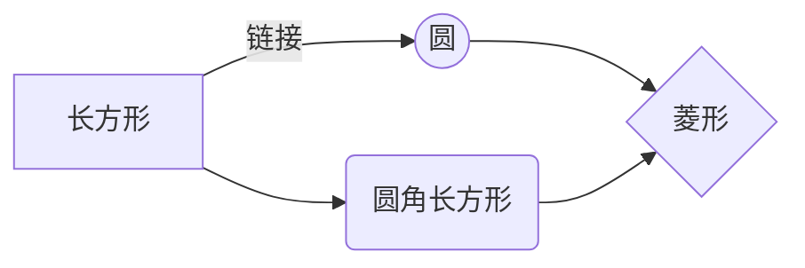

快捷键
---------------------------
撤销：Ctrl/Command + Z
重做：Ctrl/Command + Y
加粗：Ctrl/Command + B
斜体：Ctrl/Command + I
标题：Ctrl/Command + Shift + H
无序列表：Ctrl/Command + Shift + U
有序列表：Ctrl/Command + Shift + O
检查列表：Ctrl/Command + Shift + C
插入代码：Ctrl/Command + Shift + K
插入链接：Ctrl/Command + Shift + L
插入图片：Ctrl/Command + Shift + G
查找：Command + F
替换：Command + G

标题
---------------------------
# 1级标题
## 2级标题
### 3级标题
#### 四级标题 
##### 五级标题  
###### 六级标题

文本样式
---------------------------
*强调文本* _强调文本_

**加粗文本** __加粗文本__

==标记文本==

~~删除文本~~

> 引用文本

H~2~O is是液体。

2^10^ 运算结果是 1024。

列表
---------------------------
- 项目
  * 项目
    + 项目

1. 项目1
2. 项目2
3. 项目3

- [ ] 计划任务
- [x] 完成任务

链接
---------------------------
链接: [link](https://mp.csdn.net).

图片: 

带尺寸的图片: 

居中的图片: 

居中并且带尺寸的图片: 

代码片
---------------------------
下面展示一些 `内联代码片`。

```
// A code block
var foo = 'bar';
```

```javascript
// An highlighted block
var foo = 'bar';
```

表格
---------------------------
项目     | Value
-------- | -----
电脑  | $1600
手机  | $12
导管  | $1

| Column 1 | Column 2      |
|:--------:| -------------:|
| centered 文本居中 | right-aligned 文本居右 |

自定义列表
---------------------------
Markdown
:  Text-to-HTML conversion tool

Authors
:  John
:  Luke

注脚
---------------------------
一个具有注脚的文本。[^1]

[^1]: 注脚的解释

注释
---------------------------
Markdown将文本转换为 HTML。

*[HTML]:   超文本标记语言

LaTeX 数学公式
---------------------------
[参考文档](https://khan.github.io/KaTeX/)

Gamma公式展示 $\Gamma(n) = (n-1)!\quad\forall
n\in\mathbb N$ 是通过 Euler integral

$$
\Gamma(z) = \int_0^\infty t^{z-1}e^{-t}dt\,.
$$

插入甘特图
---------------------------
[参考文档](https://mermaidjs.github.io/#/gantt)



插入UML图
---------------------------
[参考文档](https://mermaidjs.github.io/#/sequenceDiagram)



插入Mermaid流程图
---------------------------
[参考文档](https://mermaidjs.github.io/#/flowchart?id=graph)



插入Flowchart流程图
---------------------------
[参考文档](http://flowchart.js.org/)

```mermaid
flowchat
st=>start: 开始
e=>end: 结束
op=>operation: 我的操作
cond=>condition: 确认？

st->op->cond
cond(yes)->e
cond(no)->op


[个人主页](https://www.baidu.com/)
<br />
<br />
[图片测试](https://image.baidu.com/search/detail?ct=503316480&z=0&ipn=d&word=%E6%98%A5%E5%A4%A9&step_word=&hs=0&pn=1&spn=0&di=177100&pi=0&rn=1&tn=baiduimagedetail&is=0%2C0&istype=2&ie=utf-8&oe=utf-8&in=&cl=2&lm=-1&st=-1&cs=2628791562%2C492781871&os=1454730926%2C1700570761&simid=3493038073%2C415058716&adpicid=0&lpn=0&ln=1117&fr=&fmq=1573651613609_R&fm=result&ic=&s=undefined&hd=&latest=&copyright=&se=&sme=&tab=0&width=&height=&face=undefined&ist=&jit=&cg=&bdtype=0&oriquery=&objurl=http%3A%2F%2Fimg.pconline.com.cn%2Fimages%2Fphotoblog%2F9%2F3%2F6%2F5%2F9365695%2F20103%2F31%2F1270022772271.jpg&fromurl=ippr_z2C%24qAzdH3FAzdH3F1r_z%26e3Brv5gstgj_z%26e3Bv54_z%26e3BvgAzdH3F1ri5p5AzdH3Fstfp_8bnca8n_z%26e3Bip4s&gsm=&rpstart=0&rpnum=0&islist=&querylist=&force=undefined)
<br />
<br />


